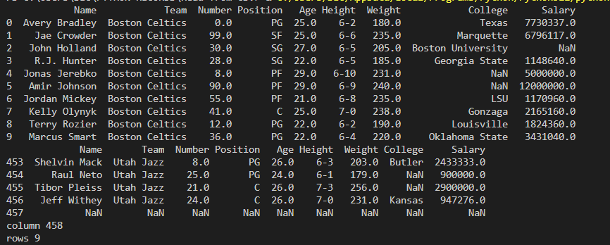

# Read-from-CSV

## AIM:
To write a python program for read from CSV

## ALGORITHM:
### Step 1:

Get the file name as the input from the user

### Step 2:

Open the file using the import function

### Step 3:

Print the program

### Step 4:

End the program


## PROGRAM:

```
Developed by  : Sakthiswar S
Ref No : 22008587

```
```python

import pandas as import pd 
df = pd.read_csv('nba.csv')
print(df.head(10))
print(df.tail())
print("column",len(df.axes[0]))
print("rows",len(df.axes[1]))

```

## OUTPUT:



## RESULT:
Thus the program is written to read from the contents from CSV file executed successfully